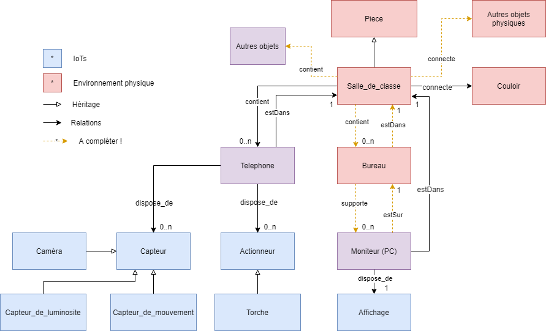
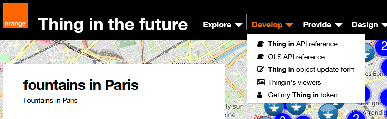
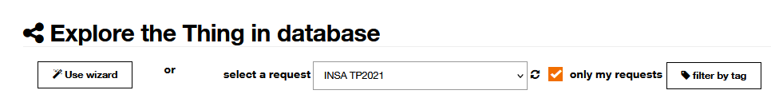
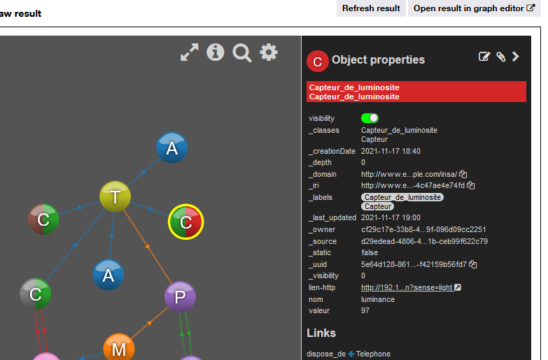

# Initiation ThingIn via PyDroidIpcam

_Forked from https://github.com/home-assistant-libs/pydroid-ipcam_ 

Requirements:
- **Requis : un PC avec python3 installé + Device android connectés au même réseau local et à internet**
- **Optionel : raspberry + sensehat, autre objets**

## Objectif du TP : 

Ce TP a pour objectif de mettre en oeuvre les notions du cours par la création d'en environnement numérique représentant 
une partie de votre environnement physique proche. Cet environnement physique étant unique et partagé, 
son pendant numérique le sera également, et il sera construit conjointement avec vos camarades. 

Dans une première partie, vous construirez en collaboration cet environnement, sur la plateforme Thingin'the future, 
la plateforme de recherche d'Orange dédiée aux jumeaux numériques et au web des objets. La construction de l'environnement inclue 
des objets connectés, ensemble composés des devices android présents dans la salle, ainsi que des autres objets 
IoT à votre disposition. Des scripts python vous sont fournis dans ce TP pour faciliter la mise en oeuvre des différentes
étapes de création et mise à jour des objets. En particulier, les scripts incluent les éléments nécessaires pour 
se connecter à la plateforme, constituer les données, et effectuer des requêtes de base. 
Vous devrez cependant éditer ces scripts / données pour ajouter des éléments manquants. 

La description de l'environnement est, dans cette première partie, fixée par un schéma de données simplifié. 
Ce schéma de données peut être vu comme un diagramme de classes simplifié, mais gardez en tête qu'il représente bien 
 **le graphe des objets de l'environnement**. 

La figure ci-dessous décrit le schéma. Vous n'aurez pas à construire ce schéma, cependant vous devrez le compléter dans
la fin de cette partie.




Dans la deuxième partie du TP, nous explorerons les capacités de recherche offertes par notre modélisation graphe, 
et étendrons la description de notre environnement à des concepts issus du web sémantique.


#Mise en place:

- installer l'apk "IP Webcam" sur votre device android
- activer les capteurs dans l'appli, accepter les demandes d'autorisations. Définir un mot de passe si souhaité
- télécharger ce dépôt. Il contient : 
  - des données préconstruites et des données à compléter 
  - des scripts python d'update des données d'ipcam vers thingin (état de la torche, valeur du capteur de lumière...) 
- mettre en place un environnement python fonctionnel avec les dépendances du dépôt, où $PROJECT_FOLDER est le chemin d'accès au dossier pydroid-ipcam : 
    - ``` export PYTHONPATH=PYTHONPATH:$PROJECT_FOLDER/ , ou commande équivalente windows ```
    - ``` cd $PROJECT_FOLDER/thingin ```
    - Tous les scripts python3 utilisés dans le TP ci-dessous peuvent être lancés depuis un IDE ou un interpréteur avec les arguments suivants (**ordre des arguments et syntaxe à respecter**): 
    ``` "$THING_TOKEN" "$THINGIN_DOMAIN" "$PRENOM_NOM" "$IPCAM_IP" "$IP_CAM_USER" "$IP_CAM_PWD" "$TORCH_ON_OFF" ``` 

        - ```$THING_TOKEN``` : votre token à récupérer sur https://tech.di.thinginthefuture.com (voir ci-après dans le descriptif du TP)
        - ```$THINGIN_DOMAIN``` : domaine à utiliser où vos données seront enregistrées dans thingin (1 domaine commun à tous les étudiants). Le domaine à utiliser est : ```http://www.insa-tp-2022.com/```
        - ```$PRENOM_NOM``` : utilisé pour générer une clé unique (peut être une autre passphrase, tant qu'elle n'est pas partagée par d'autres étudiants). 
        - ```$IPCAM_IP"``` : l'ip locale de votre device android où est installé android ipcam
        - ```$IP_CAM_USER``` : Nom d'utilisateur du serveur android IP Webcam (si défini dans l’application)
        - ```$IP_CAM_PWD``` : Password du serveur android IP Webcam (si défini dans l’application)
        - ```$TORCH_ON_OFF``` : ON ou OFF (pour allumer / éteindre la torche du device, utilisé uniquement pour tester l’installation)
        - Exemple : 
        ``` python3 bootstrap.py "Bearer 12345" "http://thingin.orange.com/users/insa-stu-2021/" "thomas_hassan" "192.168.1.18" "Test" "Test" "ON" ```
		
    Exemple de configuration via l'IDE (pycharm) : 


	
# Partie 1:
## Test d'installation et visualisation des données initiales : 
- Récupérer l'ip de votre device android. Pour la récupérer vous pouvez simplement lancer le serveur IP webcam qui vous l'affiche à l'écran.
- Sur votre ordinateur, se connecter à https://tech.di.thinginthefuture.com. Les credentials à utiliser sont : 
  - Email : ```insa-stu@insa.com```
  - Password : *******
  
Vous devriez arriver sur cette page : 

- Récupérer son token : onglet Develop -> Get My Thing in token -> Copy to Clipboard




- Lancer le serveur android ipcam sur votre device. Si nécessaire changer la résolution vidéo et le login/mot de passe. Si pas de login mot de passe dans l'application, laissez les arguments vides ("") en lançant les scripts
- Tester l'environnement : exécuter le script ```torch_test.py``` en utilisant les arguments correspondants à votre installation. Exemple : ``` python3 torch_test.py  "Bearer 12345" "http://www.example.com/insa/" "thomas_hassan" "192.168.1.18" "Test" "Test" "ON" ```
- se (re)connecter à la plateforme ThingIn avec les credentials fournis pour vérifier vos données uploadées (et celles des autres étudiants)
- Se familiariser le portail et les différentes vues (graph2D / graph3D / Map / Raw) 
  - Pour ce faire nous allons requêter notre **domaine**, http://www.insa-tp-2022.com/, qui va stocker l'environnement partagé 
  - Procédure de requête au portail thingin: 
    Onglet Explore -> Explore ThingIn Database -> Sélectionner la requête "INSA TP 2022" dans le menu déroulant (cliquer au préalable sur "only my requests" pour filtrer plus rapidement): 




Cela affichera la requête ci-dessous que vous pouvez exécuter directement (requête de type POST), cliquez sur ou get results pour afficher les données.
  ```json
  {	
    "query": {
      "$domain": "http://www.insa-tp-2022.com/"
    }
  }
  ```

- Regarder l'api (swagger) de thingin : Onglet Develop -> Thing in API reference. On accèdera ensuite à cette api à travers le code utilisé pour accéder et compléter vos données créées dans thingin. On l'utilisera également pour compléter le schéma de données de la première figure
- Ajouter votre device android à l'environnement partagé dans thingin:
    - Jeter un œil aux données qui vont être injectées, cf. fichier payloads.py
    - Exécuter le script ```bootstrap.py``` (avec arguments, cf. ci-dessus). Ce script complète les données, se connecte à la plateforme et ajoute des noeuds à l'environnement : le téléphone, certains de ses capteurs et actuateurs, et votre moniteur de PC (écran).
    - après exécution le fichier boostrap_result.json devrait être créé dans le répertoire courant et contenir la réponse de l’API thingin à la création, de la forme : 
        ``` [{"uuid": "b02531f3-8c48-480b-8259-aa256b7dbff3", "iri": "http://www.insa-tp-2022.com/androidIPCam-a82aeb9d-31a5-3f52-8714-4c47ae4e74fd", "isIn": []}, {"uuid":  .... ] ```
        où uuid est l'identifiant interne du noeud, et iri son identifiant global, suffixé par votre hash pour ce TP.

 


- **Objectif Optionnel** : la requête ci-dessus (INSA TP 2022) renvoie les avatars communs à tous les étudiants. Pour sélectionner uniquement les noeuds/relations que vous venez de créer, nous allons exploiter le **graphe** et exécuter une requête en profondeur à partir d'un de vos noeuds:
    - Toujours dans la page Explore the Thing in database, cliquez sur New Request en haut à gauche. 
      - Changer le type de requête : menu déroulant POST->GET
      - Récupérer l'identifiant interne du noeud correspondant au téléphone, dont l'iri est de la forme ``` http://www.insa-tp-2022.com/androidIPCam-$hash ```, stocké dans le fichier bootstrap_result.json. Il devrait s'agir du premier noeud de la liste. Bien prendre l'uuid, pas votre hash qui suit l'iri.
      - Entrer l'url de requête GET suivante à droite du menu déroulant : ```/avatars/$uuid?Read-Mode=depth&Read-Depth=10```, en remplaçant $uuid par l'uuid récupéré précédemment
      - Le résultat de cette requête devrait contenir uniquement vos noeuds/relations et pas ceux de vos camarades


## Extension du schéma de données et ajouts de nouveaux objets à l'environnement

De la même façon que pour les noeuds correspondants aux pièces et aux téléphones, déclarer des noeuds pour vos autres devices, ainsi que pour enrichir l'environnement partagé (pièces adjacentes, mobilier de la salle de classe, murs, fenêtres...). Vous pouvez commencer par modéliser les parties manquantes du schéma indiquées dans la première figure, i.e. chacun de vos bureaux et les relier à vos moniteurs et à la salle de classe avec la relation appropriée. Pour ce faire vous pouvez modifier le code source du projet et créer un nouveau payload de données en prenant exemple sur les données existantes. 
 
Il vous manquera éventuellement des "_types_" d'objets (ou _classes_) et des types de relation pour modéliser l'environnement. Vous allez utiliser directement l'API de thingin pour les ajouter et vous en servir dans le code. La procédure est la suivante (elle vous sera montrée en détail) :  Onglet Develop -> Thingin API reference -> "Labels : Manipulate the labels of the tipod". 

Attention les payloads ci-dessous ne font que compléter la partie "schéma" de données, mais n'ajoutent pas de nouveaux noeuds/relations.
Pour créer un nouveau _type_/_classe_ d'objet, le payload est le suivant : 
```json
{
  "name": "Exemple_de_type",
  "description": "C'est juste un exemple !",
  "type": "instance"
}
```

Pour créer un type de _propriété_ (attachée à une instance/noeud), le payload est le suivant : 
```json
{
  "name": "Exemple_de_propriété",
  "description": "C'est juste un exemple de type de propriété !",
  "type": "property"
}
```

Pour créer un type de _relation_ (entre deux instances/noeuds), le payload est le suivant : 
```json
{
  "name": "Exemple_de_relation",
  "description": "C'est juste un exemple de type de relation !",
  "type": "relationship"
}
```

# Partie 2 : 

Dans cette partie nous allons :  
- mettre à jour de façon continue les données issues de nos capteurs / devices 
- effectuer des requêtes plus abouties sur l'environnement. 
- proposer des améliorations pour pallier les difficultées rencontrées dues à notre modèle de données simpliste.  

## Requêtage simple de l'environnement 

- Retrouver tous les téléphones : nous allons utiliser le language Cypher pour retrouver uniquement les téléphones des différents étudiants. Le résultat de la requête va donc évoluer en fonction de l'avancée des groupes. 

```json
{
  "cypher": "MATCH ({label : 'Telephone'}) RETURN *"
}
```

Une autre façon d'exprimer la requête est la suivante, plus compacte :
```json
{
  "cypher": "MATCH (a:`Capteur`) RETURN a"
}
```

Avec les deux requêtes ci-dessus, vous aurez peut-être remarqué un nombre anormal de capteurs/téléphone : il y a des entités provenant d'autres domaines que le notre.
On affiner la requête avec un filtre sur ses propriétés, par exemple en précisant le domaine dans lequel nous effectuons notre requête : 
```json
{
  "cypher": "MATCH ({label: 'Telephone', domain:'http://www.insa-tp-2022.com/'}) RETURN *"
}
```

- A l'aide de l'exemple ci-dessus et du et du [wiki](https://wiki.thinginthefuture.com/en/public/CypherForThinginQuery), construisez une requête pour retrouver des objets en définissant un filtre sur leur nom ou leur description.

## Mise à jour des données de capteur en temps réel
- Retrouver les endpoints de l’API android ipcam dans les propriétés des nœuds correspondants aux différents capteurs à travers l’interface ThingIn. Pour afficher les propriétés d'un noeud il suffit de cliquer dessus
- Lancer le script de mise à jour des données dans thingin, ```main.py```, qui accède à l'API du device, récupère les données et accède à l'API de thingin pour mettre à jour les noeuds précédemment créés de façon continue (environ toutes les 5 secondes)
- Vérifier la mise à jour des données dans thingin via la visualisation. Vous pouvez rafraichir le résultat de la requête via l'interface web (bouton 'Refresh result')



- A l'aide des exemples de requêtes précédents et du [wiki](https://wiki.thinginthefuture.com/en/public/CypherForThinginQuery), construisez désormais les requêtes suivantes : 
    - Retrouver uniquement votre téléphone à partir d'un de ses identifiants unique (iri ou uuid)
    - Idem mais retrouvez également **via ses relations** tous ses capteurs
    - Retrouver les téléphones dont le ```Capteur``` de luminosité a une ```valeur``` inférieure à X 
    - Retrouver le capteur le plus illuminé de deux téléphones différents

- Compléter les données pour le device IPcam, en ajoutant un noeud de type ```Capteur``` et une ```propriété``` pour décrire le **status** actuel de la torche (on/off). Pour créer le noeud, on peut directement utiliser l'API de thingin sans éditer le code (montré pendant le TP). Pour accéder à l'état de la torche et faire sa mise jour temps réel dans thingin, les fichiers ```thingin_requests.py``` et ```main.py``` doivent être édités : 
        - Définir une nouvelle fonction ```put_torch_status_thingin``` dans ```thinin_requests.py```, en prenant exemple sur les fonctions existantes (motion et light)
        - Utiliser la fonction précédemment créée dans ```main.py```, dans la fonction ```update_data(cam)```
- Vérifier de nouveau la mise à jour des données dans thingin via la visualisation (relancer le script main.py)
